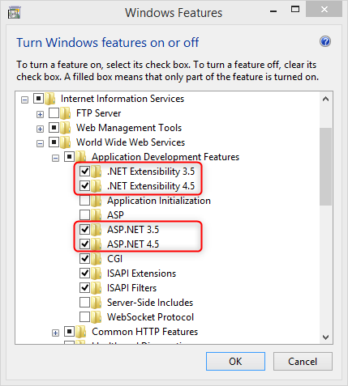
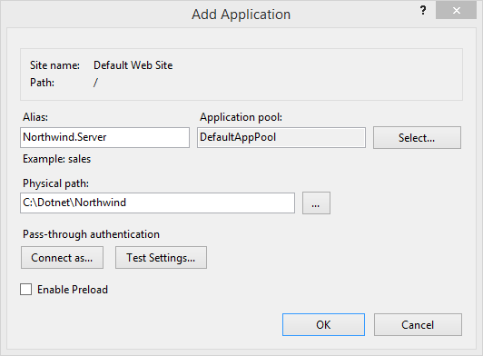
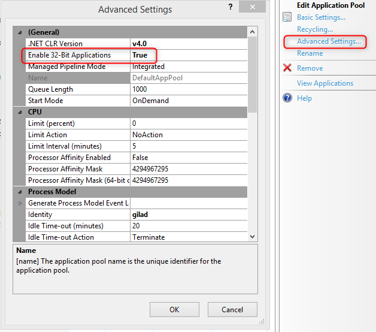
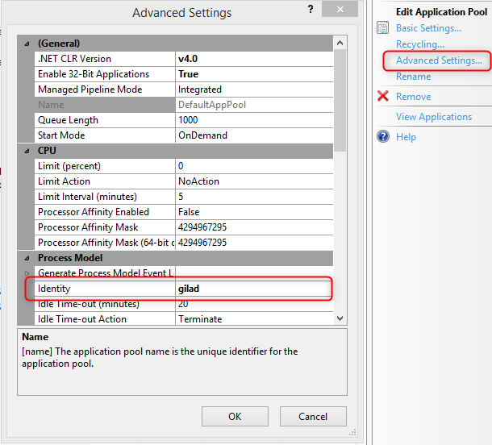

# IIS Configuration

This article covers the configuration needed to implement .NET migrated web application in IIS.
First, let’s explain the architecture of .NET web comparing to the Magic web.

When a request is received from the Web, Magic handles it using three layers:
-	Requester (mgriqispi.dll)
-	Application Server (Broker)
-	Application code

As oppose to Magic, .NET handles the request using only two layers
-	Application Server (IIS)
-	Application code

.NET uses the IIS as a standard application server.

#### Configuration

##### .NET and ASP extensions

Make sure .NET and ASP are installed on the IIS server

##### Application

Under the Web site, add an application with the alias name of the [project 
name].Server (Northwind.Server) and point it to its folder (physical directory)

The main files in this folder are:
-	Bin folder – the .NET binaries (migrated code)
-	Request.aspx – the requester
-	Services.aspx  - for Remote requests (Web Services, CMD and etc)
-  INI file (Northwind.Server.ini)

##### 32-bit application

Since Magic is a 32-bit application, the migrated code is also a 32-bit application so make sure that the Application Pool of the Web site Enables 32-bit applications

#### User identity 

IIS is running under the build-in user (who logged to the server) or a custom user. Make sure to add sufficient rights to the relevant user.

