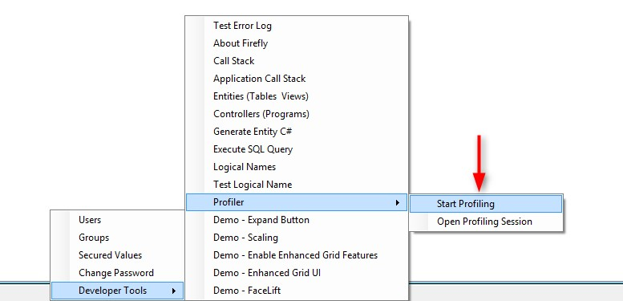
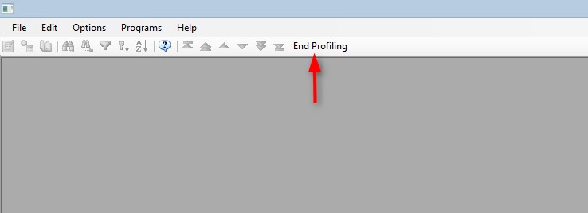
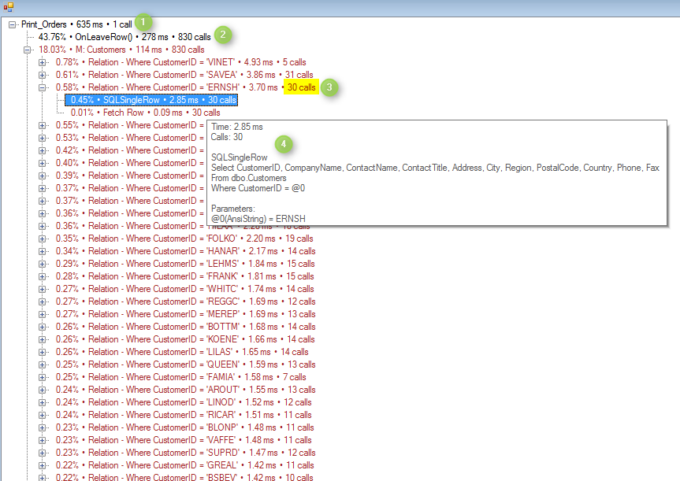

# Performance Improvement by using Firefly Profiler tool

In order to improve the application’s performance, we provide a Profiler tool which helps to analyze the application code and find performance bottlenecks.

1) Starting the Profiler  
While the application is open, Right-Click on the status bar:  
**Developer Tools -> Profiler** -> Click **Start Profiling**:

Run a process you would like to observe.

2) End the Profiler
Once the process is done, click **End Profiling** in the toolbar menu

3) Reviewing the Profiler results
Clicking **End Profiling** will open the results window.

Let’s observe the results:

a. The process total elapsed time is 635 ms (1)
b. The order of the Profiler result is based on the processing time (in ascending order). In our case we can see that the longest processing time is 278 ms (43.76% of the entire process) which was spent inside OnLeaveRow() and was called 830 times. (2)
c.  Profiler Colors:
Black – Code Information
     Brown – Code related to the database
     Red –  Code Exception
d. There is a Relation to table Customers. There were 830 SQL calls to the database and we can see that each query was sent several times to the database. (3)
This stems from the cache option which was not set to TRUE.
Setting the cache to TRUE for the Customers model will reduce the number of calls dramatically and improve the performance.