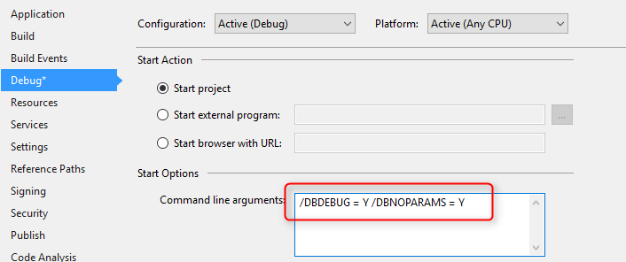
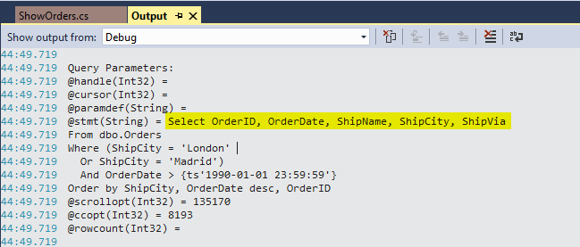

### The Columns Collection

1. The **columns collection** of a UIController or a BusinessProcess represents the data that is being used by the program.
2. **Only** the columns that are in the columns collection will be selected from the database.
3. Add the following entries to the main project under the debug menu:
    a.	/DBDEBUG = Y
    b.	/DBNOPARAMS = Y

4.	Open the Output window from the View menu and notice that now all the SQL statements will be printed to the Output window.
5.	These entries are very helpful for debug purpose and should not be used in production. Especially not the DBNOPARAMS.
6.	Run the “ShowOrders” program and observe the SELECT statement in the Output window.
7.	Note that all the columns from the main table and related tables are selected.

8.	So far, we've learned how to control different parts of the SQL statement:
    a. From – by using the `From` and `Relations.Add`
    b. Where – by using the `Where.Add` 
    c. Order By – by using the `OrderBy.Add`
Now we're going to see how to control the SELECT part of the SQL.
9.	Add the following columns:
```csdiff
public ShowOrders()
{
    From = Orders;
    Relations.Add(Shippers, RelationType.Find,Shippers.ShipperID.IsEqualTo(Orders.ShipVia));
    Where.Add(Orders.ShipCity.IsEqualTo("London").Or(Orders.ShipCity.IsEqualTo("Madrid")));
    Where.Add(Orders.OrderDate.IsGreaterThan(1990,1,1));
    OrderBy.Add(Orders.ShipCity);
    OrderBy.Add(Orders.OrderDate, SortDirection.Descending);

+    Columns.Add(Orders.OrderID, Orders.OrderDate, Orders.ShipName, Orders.ShipCity, Orders.ShipVia, Shippers.ShipperID, Shippers.CompanyName);
}
```

10. Note that the Columns.Add method can take a coma-separated list of columns (unlike Magic)
11. Run the program again and show the SELECT statement in the Output window.
12. Note that now, only the columns that were added to the columns collection are selected.
_
13. **Important:**
    a. If you do not select all the required columns, they will be added automatically (show by adding only OrderID).
    b. The Columns collection has no bearing on the columns that are available 
    c. in the View design – all the columns are available to the view.

14. Exercise: The Columns Collection


