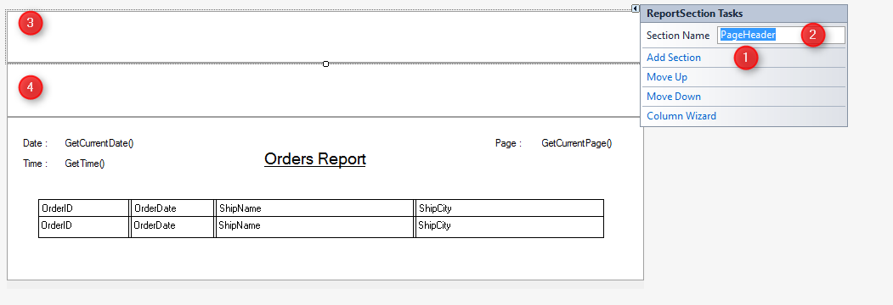

### Using Groups
1.	Sometimes we need to add **subtitles** or **subtotals** to our report.
2.	To achieve this we need to use **Groups** that will let us split the data into groups with a common value in a certain column.
3.	Let’s see an example. We will add a **subtitle** to my report for each "ShipCity".
4.	First, we need to **sort** our report by the column with the group shared value.
```csdiff
public OrdersReport()
{
    From = Orders;
+   OrderBy.Add(Orders.ShipCity);
}
```
5.	Now, let’s add **2 sections** to our report layout: one for the main title and another for the subtitle. In the report designer, add 2 new sections, using the quick menu of the layout and name them: `PageHeader` and `GroupHeader`.
  
6.	Drag the report main title to the `PageHeader` section.
7.	Add a textbox to the `GroupHeader` section and assign it to the `ShipCity` column.
Make it look like a subtitle (bold, underlined).
8.	Make the grid closer to the upper border of its section and leave a small amount of white space after the grid.
9.	The report layout should look like this:

10. Go back to the BusinessProcess class and now we have two new sections that need to be printed. The `PageHeader` section should be printed at the **top** of **each page** and the `GroupHeader` section should be printed **before each** new **group** of rows.
11. To print the subtitle before each group, we need to add a Group to our BusinessProcess to tell it to monitor a certain column for us and let us do something whenever the value in that column changes (Just like Group prefix/ suffix in Magic).
12. Notice that the **monitored column** is the column we are **sorting** the report by.
13. Next, add an event handler to the "Enter" event of the group by pressing Tab twice after typing the += operator.
```csdiff
public OrdersReport()
{
    From = Orders;
    OrderBy.Add(Orders.ShipCity);

+   Groups.Add(Orders.ShipCity).Enter += OrdersReport_Enter;
            
}
+ private void OrdersReport_Enter()
+ {
+     _layout.GroupHeader.WriteTo(_printer);
+ }

```
14. Notice that "Enter" is an event in C# and that `+=` is the syntax of subscribing to the event. Pressing Tab twice generates a handler method automatically.
15. This `WriteTo` method used in the handled is the equivalent of the "Write Output" in Magic. (Output Form)
16. We still need to print the PageHeader. This is easy. We will just tell the printer which section is the page header and the printer know when a new page is being printed so it will take care of the page header printing for us.
```csdiff
protected override void OnLoad()
{
    _layout = new Printing.OrdersReportLayout(this);
-   _printer = new PrinterWriter { PrintPreview = true };
+   _printer = new PrinterWriter { PrintPreview = true, PageHeader = _layout.PageHeader };
    Streams.Add(_printer);

    _time.Value = Time.Now;
}
```
17. Build and run.
18. Exercise: Using Groups

