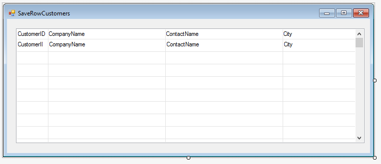
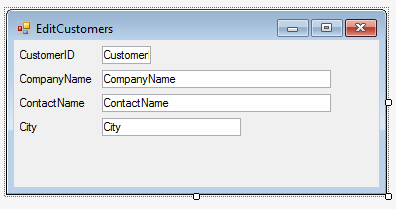

### SaveRowAndDo
1.	Create UIController named "SaveRowCustomers" with the following columns:

2.	Create another UIController named "EditCustomers" with the following columns:

3.	Add a filter to the "EditCustomers" class using the "CustomerID"
```csdiff
public void Run(Text customerId)
{
+   Where.Add(Customers.CustomerID.IsEqualTo(customerId));
    Execute();
}
```
4. In "SaveRowCustomers" add a button "Edit Customer" that will call "EditCustomers" and send it the CustomerID.
5. Add "SaveRowCustomers" to the menu
6. Build and Run
7. In "SaveRowCustomers" change the value of the customer name and click on the button. You will notice that in the "EditCustomers" screen, the old value name is displayed.
8. Create a method EditCustomer() in the controller
9. Use the `SaveRowAndDo()` method to save the data prior to calling "EditCustomers"  program. 
```csdiff
+ internal void EditCustomer()
+ {
+     SaveRowAndDo(uioptions => new EditCustomers().Run(Customers.CustomerID));
+ }
```
10. Explain about the UIOptions parameter, using `uioption.GoToLastRow()` for example.
```
internal void EditCustomer()
{
-    SaveRowAndDo(uioptions => new EditCustomers().Run(Customers.CustomerID));
+    SaveRowAndDo(c=>
+    {
+        c.GoToLastRow();
+        new EditCustomers().Run(Customers.CustomerID);
+    });
}
```
13. Build and run
14. You will notice that now the new value is displayed in "EditCustomers".
15. Exercise: SaveRowAndDo

