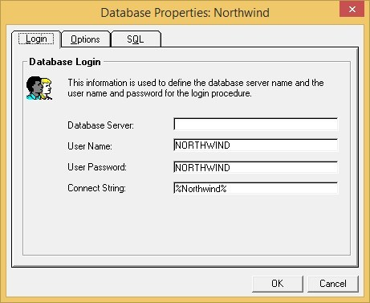

# Replacing the Tnsnames.ora file with INI setting

### General
Magic is using Oracle client to access Oracle DB.  
The client reads the Tnsnames.ora file to get details 
of the relevant Oracle data location (server, user).  

The location of this file can be set using various methods -
you can read more about it [here](http://www.dba-oracle.com/t_windows_tnsnames.ora_file_location.htm).

### in .Net
The migrated code is not using Oracle client but rather 
ODP (Oracle Data Provider for .NET) - you can read about
it [here](http://www.oracle.com/technetwork/topics/dotnet/index-085163.html).  
Because of that it is not aware of the location of the Tnsnames.ora 
file - this has to be copied next to the EXE file 
or be places in the path.

### The alternative
You can easily replace the use of the Tnsnames.ora file
by placing the connection details in the INI.

### How to do it
1. Open the DB settings in Magic
2. Open relevant DB properties screen
3. Remove the Database Server value
4. Specify a logical name in the Connect String 
5. Add the matching logical name - it will contain the connection string copied from the Tnsnames.ora in a one line format

After the change the DB properties should look like this:  

(alternatively you can change the INI manually)

This is the matching entry in the Tnsnames.ora:  
Northwind = 
    (DESCRIPTION =
      (ADDRESS_LIST =
        (ADDRESS = (PROTOCOL = TCP)(HOST = 1.2.3.4)(PORT = 1521))
      )
      (CONNECT_DATA =
        (SERVICE_NAME = orcl)
      )
  )

So the logical name should look like this:  
[MAGIC_LOGICAL_NAMES]  
Northwind = (DESCRIPTION = (ADDRESS_LIST = (ADDRESS = (PROTOCOL = TCP)(HOST = 1.2.3.4)(PORT = 1521))) (CONNECT_DATA = (SERVICE_NAME = orcl)))