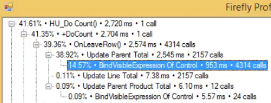
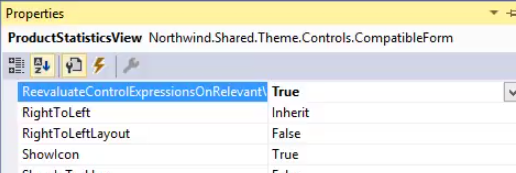
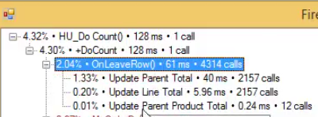

This article explains the performance problem presented in the [Using the Profiler to Investigate non database Related Performance Issues](using-the-profiler-to-investigate-non-database-related-performance-issues.html) article.

Iמ application that were migrated from magic versions prior to XPA, all the expressions used on the `View` of a `Controller` were 
re-evaluated after an update of **any** `Column` in the `Controller`.

This can have a performance cost. In the example used in this article's video, we can see that the `BindVisible` method was evaluated 4314 times, just by the "Update Parent Total" part of the `OnLeaveRow` (while being totally irrelenat to the `BindVisible` method or values)

We can control this behavior, by changing the `Form` property called `ReevaluateControlExpressionsOnRelevantValueChangeOnly` to `true`  

This property means that an `Expression` for a `Control` on the `Form` will only be re-evaluated if a column that was used in that expression was changed.

This has a positive affect on the process, essentially removing thousands of expression evaluations, improving our process by a factor of 10.  

> Note that this property might also have side effects. If you have an expression that is based on a Column from another `Controller`, or not based on a column at all (ie `GetParam` or `Time`) it will not get evaluated.

<iframe width="560" height="315" src="https://www.youtube.com/embed/wxJfeSuRRqc?list=PL1DEQjXG2xnJYzlRYRjwUfqSc4Kx0yarM" frameborder="0" allowfullscreen></iframe>
