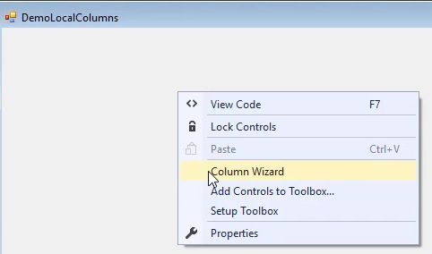

In this section, we'll discuss local columns and BindValue
* Just like you can add a column to an Entity, you can have a local column defined in the scope of a controller
* Create a "DemoLocalColumn" Controller
* Add a member called "FromDate" of type `DateColumn`
```csdiff
public class DemoLocalColumns : UIControllerBase
{
+   public readonly DateColumn FromDate = new DateColumn("From Date");
+   public readonly DateColumn ToDate = new DateColumn("To Date");
    public DemoLocalColumns()
    {
    }
    public void Run()
    {
        Execute();
    }
    protected override void OnLoad()
    {
        View = () => new Views.DemoLocalColumnsView(this);
    }
}
```
* Make sure to build the project
* Add the `FromDate` and `ToDate` members to the screen using the "Column Wizard"



<iframe width="560" height="315" src="https://www.youtube.com/embed/pdFGzK1SJ2s?list=PL1DEQjXG2xnKHKNIRzI4K6oZL-KulU-Vw" frameborder="0" allowfullscreen></iframe>