keywords:Symbols for the module 'ENV.dll' were not loaded
In this document we'll detail how we configure Visual Studio 2017 to make the most out of it while working with large migrated applications.

Although this document was written with Visual Studio 2017 in mind, most of it is also relevant to previous versions of Visual Studio.

These are the extensions and settings we use - since they are our preferences none of them are mandatory but they are highly recommended.

## A - Visual Studio Extentions
### A.1 - Class Outline
A tool that shows you a window with all the classes and inner classes in a C# code file.

When you right click on any node, you'll see the different important methods of it, such as OnStart etc... and will also be able to go directly to the controller's view

* [The official 2015 version](https://marketplace.visualstudio.com/items?itemName=Stickle.ClassOutline)  
* [The Beta 2017 version](https://github.com/FireflyMigration/ClassOutline/releases)

### A.2 - VS Drop Assist
Allows for drag and drop of various objects from the solution into the code.
* [The official 2015 version](https://marketplace.visualstudio.com/items?itemName=Stickle.VSDropAssist)  
* [The Beta 2017 version can be found in this thread for now](https://github.com/FireflyMigration/VSDropAssist/issues/34)

## B - Templates and Snippets
Download the latest templates-and-snippets.zip from:  [https://github.com/FireflyMigration/VisualStudioTemplates/releases](https://github.com/FireflyMigration/VisualStudioTemplates/releases)

In that zip you'll find two folders:
* Templates
* Shortcuts

### B.1 - Placing the Templates folder
In Visual Studio: 
1. Open the "Tools\Options" menu  

2. Select "Project and Solutions"
4. Copy the path under "User item templates location" and open it in your file explorer  
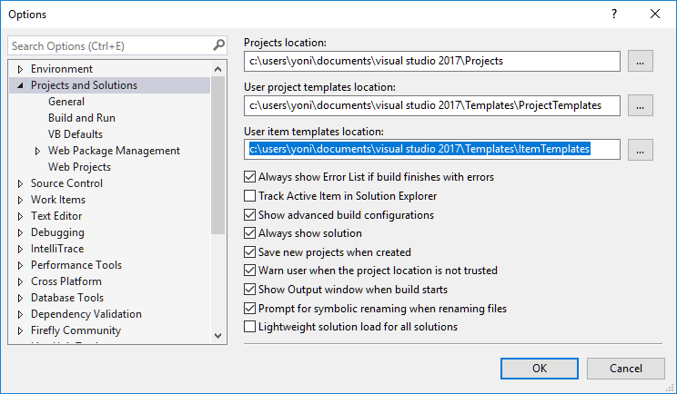
5. Open the "Visual C#" folder  
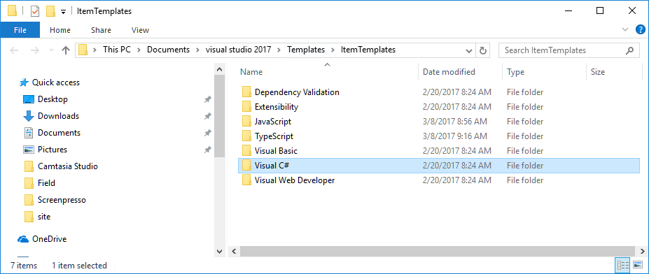
6. Place the Templates folder from the downloaded zip file, in this directory  
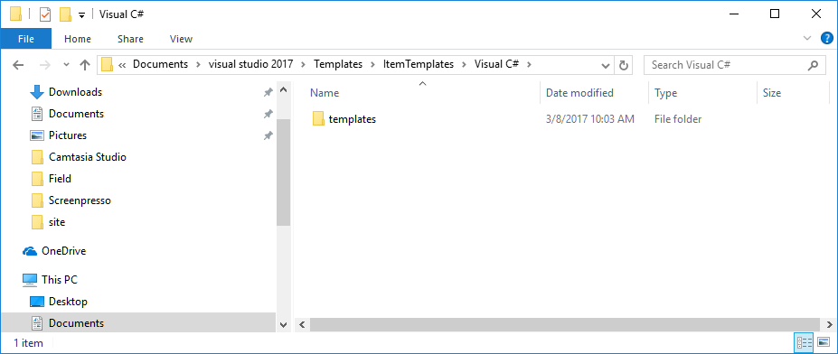

### B.2 - Placing the Shortcuts folder
You can place the shortcuts folder anywhere on your local machine - you'll just need to tell Visual Studio where to find it.
1. Goto the "Tools\Code Snippets Manager..." Menu
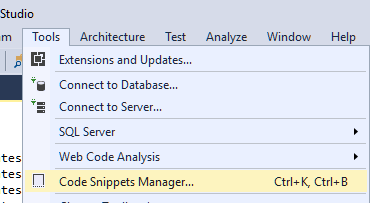
2. In the Language Combo select "csharp"
3. Click the Add... button
3. Select the "Shortcuts" folder that you've downloaded
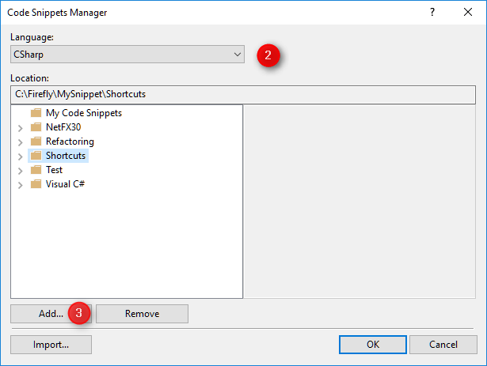 

## C - Other important settings that improve the performance and experience in Visual Studio
The following settings are in the  "Tools\Options" menu

### C.1 set "Automatically Populate Toolbox" to False
In the "Windows Forms Designer" tab
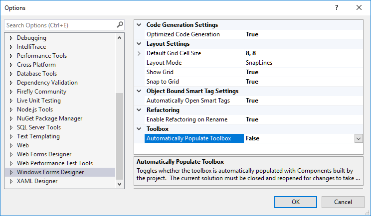
**Improves performance** after each build

### C.2 - "Debugging" Tab
#### C.2.1 - Uncheck "Warn if no user code on launch (Managed only)"
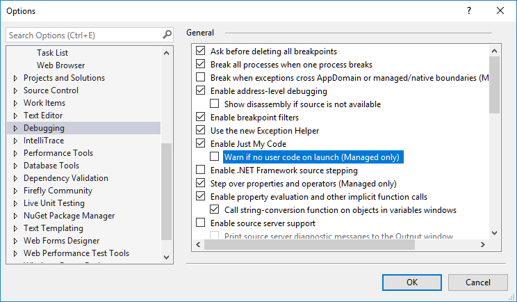
Eliminates the "Symbols for the module 'ENV.dll' were not loaded" message you get every time you run the code

#### C.2.2 - Uncheck "Enable Edit and Continue"
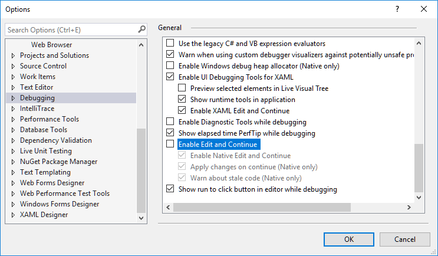
Allows you to edit your code, while the application is running
#### C.2.3 - Uncheck "Enable Diagnostic Tools while debugging"
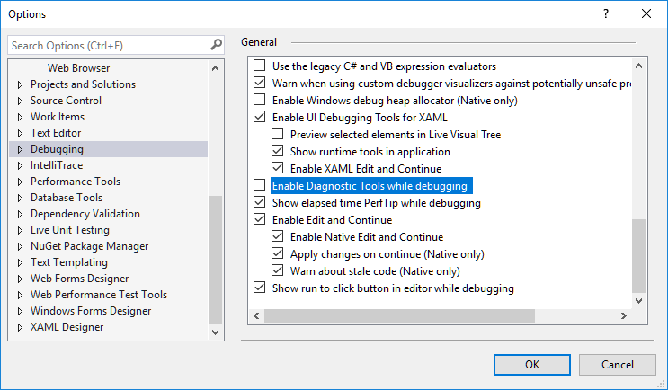
**Improves performance** when running in Debug
### C.3 Disable IntelliTrace
1. Go to the "IntelliTrace" Tab
2. Uncheck the "Enable IntelliTrace" checkbox

**Improves performance** when running in Debug
### C.4 Disable "full solution analysis"
1. Go to the "Text Editor\C#\Advanced" Tab
2. Uncheck the "Enable full solution analysis" check box, under "Editor Help"  
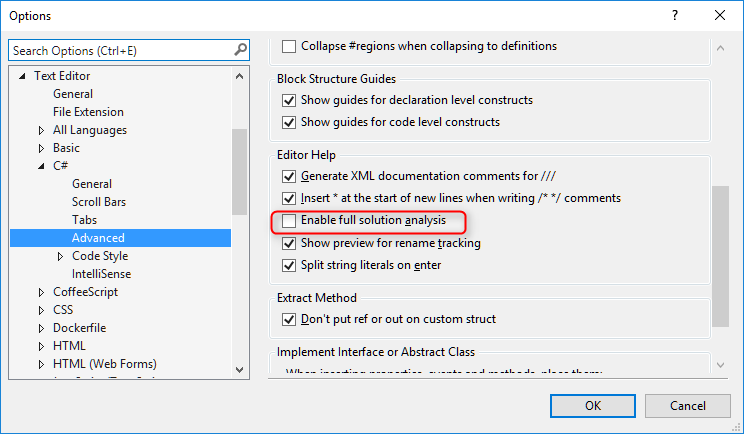
**Improves performance**
### C.5 - Track Active Item in Solution Explorer 
This instructs Visual Studio to highlight in the "Solution Explorer" the current code file you are in, so that when you move between different code files, you'll see their place in the "Solution Explorer"
* In the "Project and Solutions" tab, check the "Track Active item in Solution Explorer"  
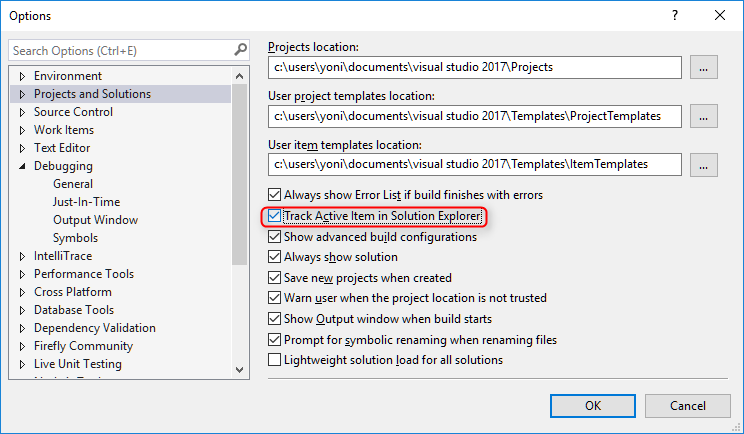

### D - Configure the "Error List..." Window
1. Go to "View\Error List" menu  

2. Uncheck the "Warnings" tab by clicking on it (Our preference, not mandatory)
3. Uncheck the "Messages" tab by clicking on it (Our preference, not mandatory)
4. Set the combo to "Build Only"  

### E - Disable "Preview Selected Item"
In the "Solution Explorer" window make sure that the "Preview Selected Item" Icon is not checked (highlighted)  
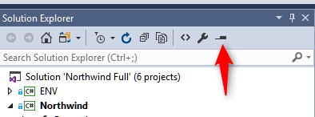

### F - Add the parameter information toolbar item
1. On the toolbar
2. Click on the icon highlighted in the image as 2  

3. Select "Add or Remove Button"
4. Select the "Parameter Info" Tool box item.

This adds the following toolbox item, that will show you the parameter information for a method you are parked on

1. 
2. 

### G - Configure the "GoTo" window
Go To the "Edit\Go To\Go To All..." menu item  

1. Click the "Settings" button  

2. Uncheck the "Use Preview Tab" CheckBox
3. Check the "Show details" CheckBox
