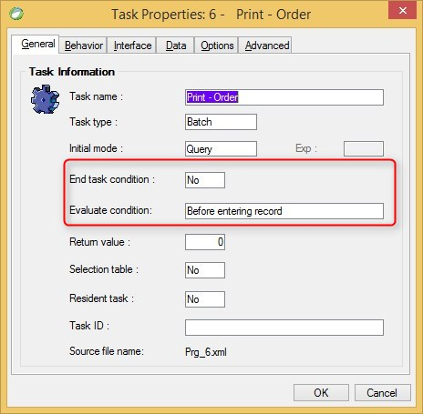

Keywords:exit,checkexit,BindExitAsSoonAsPossible,onload, task properties
# End Task Condition, Evaluate Condition for End Task

Name in Migrated Code: **Exit**  
Location in Migrated Class: **OnLoad Method**  



Values:  

| Magic Name                            | Migrated Code Name |
|---------------------------------------|--------------------|
| Before Entering Record                | BeforeRow          |
| After Updating Record                 | AfterRow           |
| Immediately when condition is Changed | AsSoonAsPossible   |

Example: Exit:
```csdiff
Exit();
```
Example: Exit Before Row:
```csdiff
Exit(ExitTiming.BeforeRow, () => u.EOF(0, 1));
```
Example: Exit After Row
```csdiff
Exit(ExitTiming.AfterRow, () => Counter == 10);
```


### "Immediately when condition is Changed" - ExitTiming.AsSoonAsPossible

#### BindExitAsSoonAsPossible
In most cases this exit condition will be translated to:

```csdiff
BindExitAsSoonAsPossible(() => Orders.ShipCity == "London", Orders.ShipCity);
```

* The first argument is the condition, and the other arguments are columns that on their change, the controller should reevaluate the Exit Condition.


#### CheckExit
As stated, the 'Immediately when condition is changed' option, translates in the migrated code to ExitTiming.AsSoonAsPossible. In this scenario, magic evaluates the end condition after each operation in the code. 

To support this behaviour in most cases we migrate it to `BindExitAsSoonAsPossible` is indicated above. 
In all other cases  migrated code with this option will place the `CheckExit()` Method between each line of code.  
Example:
```csdiff
protected override void OnLoad()
{
   Exit(ExitTiming.AsSoonAsPossible,() => u.GetParam("exit"));
}

protected override void OnLeaveRow()
{
+   CheckExit();
    numerator.Value = 1;
+   CheckExit();
    Warning("Message to User");
+   CheckExit();
    numerator.Value = 2;
}
```
In this example, the task will end, even though at the end of the OnLeaveRow the numerator value was 2, because in second row it was set to 1, and then the CheckExit method was called, and the condition evaluated to true.

---
**See Also:**

- [UIController Exit Method + examples](http://www.fireflymigration.com/reference/html/M_Firefly_Box_UIController_Exit.htm)
- [BusinessProcess Exit Method + examples](http://fireflymigration.com/reference/html/M_Firefly_Box_BusinessProcess_Exit.htm)
- [Exit Method Overloads](http://www.fireflymigration.com/reference/html/Overload_Firefly_Box_BusinessProcess_Exit.htm)

---