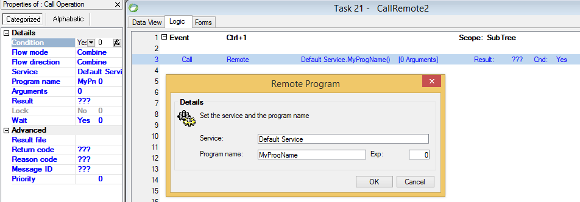

keywords: Call Remote




### Migrated Code Examples:

**Simple Call remote**

```csdiff
new Shared.Remoting.DefaultService().Run("MyProgName");
```


**Call remote based on expression**

```csdiff
new Shared.Remoting.DefaultService().Run(u.If(TableB.Name1 == "", "MyprogName2", "MyprogName1"));
```


**Call remote with Argument**
```csdiff
new Shared.Remoting.DefaultService().Run("MyProgName", TableB.Code);
```

**Using Result**
```csdiff
Result.Value = u.CastToNumber(new Shared.Remoting.DefaultService().Run("MyProgName", TableB.Code));
```

**Using Wait = No**
```csdiff
new Shared.Remoting.DefaultService().RunAsync("MyProgName", TableB.Code);
```

**Using Result File name**
```csdiff
new Shared.Remoting.DefaultService
{
    ResultFileName = @"C:\Temp\file.txt"
}.Run("MyProgName", "aaa");
```

**Using Return code**
```csdiff
new Shared.Remoting.DefaultService
{
    ResultFileName = @"C:\Temp\file.txt",
    ReturnCodeColumn = ReturnCode
}.Run("MyProgName", "aaa");
```

**Using Reason code**
```csdiff
new Shared.Remoting.DefaultService
{
    ResultFileName = @"C:\Temp\file.txt",
    ReturnCodeColumn = ReturnCode,
    ErrorCodeColumn = Reason
}.Run("MyProgName", "aaa");
```

**Using Message ID**
```csdiff
new Shared.Remoting.DefaultService
{
    ResultFileName = @"C:\Temp\file.txt",
    ReturnCodeColumn = ReturnCode,
    ErrorCodeColumn = Reason,
    MessageIDColumn = MessageID
}.Run("MyProgName", "aaa");
```


