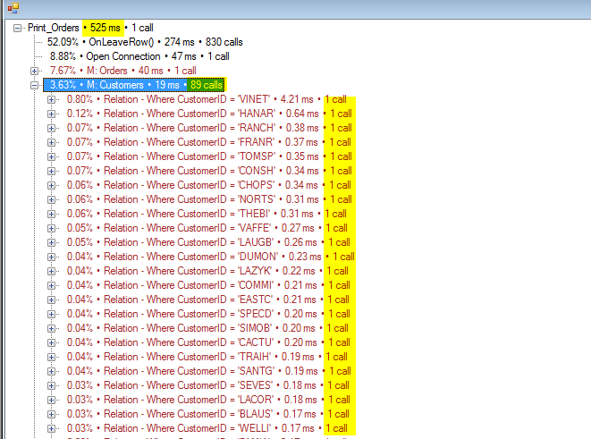
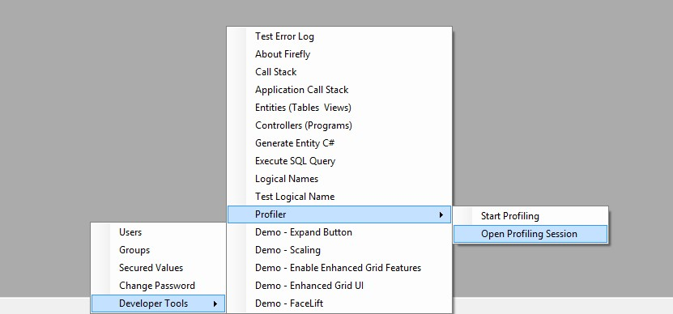

Firefly provides a Profiler tool which helps to analyze the application execution and find issue and performance bottlenecks.

1) Starting the Profiler  
While the application is open, Right-Click on the status bar:  
**Developer Tools -> Profiler** -> Click **Start Profiling**:

Run a process you would like to observe.

2) End the Profiler
Once the process is done, click **End Profiling** in the toolbar menu

3) Reviewing the Profiler results
Clicking **End Profiling** will open the results window.

Let’s observe the results:

a. The process total elapsed time is 635 ms **(1)**
b. The order of the Profiler result is based on the processing time (in ascending order). In our case we can see that the longest processing time is 278 ms (43.76% of the entire process) which was spent inside OnLeaveRow() and was called 830 times. **(2)**
c.  Profiler Colors:  
    * **Black** – Code Information  
    * <strong style="color: #800000;">Brown </strong>– Code related to the database  
    * <strong style="color: #ff0000;">Red</strong> –  Code Exception  
d. There is a Relation to table Customers. There were 830 SQL calls to the database and we can see that each query was sent several times to the database. **(3)**  
This stems from the cache option which was not set to TRUE.  
Setting the cache to TRUE for the Customers model will reduce the number of calls dramatically and improve the performance.  

Running the same process again we can see the database access to the Customers table has been decreased significantly.

a. The processing time of the Customers table access was reduced to 19 ms from 114ms – **an 83% improvement.**
b. There were only 89 SQL calls to the database instead of 830!
c.  The Relation for each Customer occurred only once.

4) Reviewing the Profiler options
Right-Click on the results screen will bring a context menu with 3 options:

   * **Details** – You can Right-Click on any line to see the information such the actual SQL statement and the program path. You can also click Enter or hover above the line to see the details **(4)**
   * **Save** – You can save the profiler result to a file.
   * **Large Fonts** – Will enlarge the fonts on the results screen
   * **Search**

5) Open saved Profiler file

6) Profiler for the web or Profiler without Developer tools  
Simply add an entry to the INI file:

Profiler= c:\temp\path

The result will be a file with *.prof extension.  
Notice that a Profiler for the Web will create a file for each request

7) Profiler for Parallel programs   
To start profiling parallel context stand on the window of the context you would like to debug and press Ctrl+Shift+P, that will start profiling.
To end profiling press Ctrl+Shift+P again.  

The Profiler is part of the migrated solution but you can also download it from here:
http://doc.fireflymigration.com/fireflyprofiler.html
