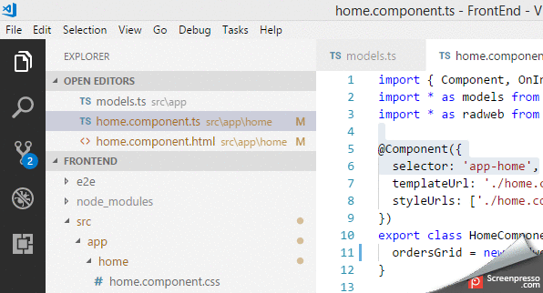


When we develop this demo we use Visual Studio 2017 for the server side, and Visual Studio Code (VSCode) for the Front End.

If you wonder why, see:
[Why am I using both Visual Studio 2017 and Visual Studio Code for web development](https://medium.com/@noam_11690/why-am-i-using-both-visual-studio-2017-and-visual-studio-code-for-web-development-7d7d71a40785)

# PreRequisites:
Please install the following :
## Visual Studio 2017 
We use Visual Studio 2017, version 15.3.5, although this demo can also work on previous version of Visual Studio.

## Node JS
Node.js is an open-source, cross-platform JavaScript runtime environment for executing JavaScript code server-side.

Install it from: https://nodejs.org/en/

## Visual Studio Code 
A source code editor which we use to develop the client side.
1. Install it from: https://code.visualstudio.com/
2. During the installation wizard check all the checkboxes in the "Select Additional Tasks" screen
3. Download the "Angular Language Service" extension from the Marketplace:

## Northwind Version
This demo is using the NorthwindTraining project that is used for training.
If you have a version older than 9/2017, please contact us to get a recent version.

## The code used in this demo
You can download the files that are used for this tutorial on https://github.com/FireflyMigration/ENV.Web/releases/tag/v0.0.5-pre-alpha

Please use the 2017-12 version

# Setup
These are the steps you'll need to follow to setup the project, it may be a bit long but we tried to make it as simple as we can :)
