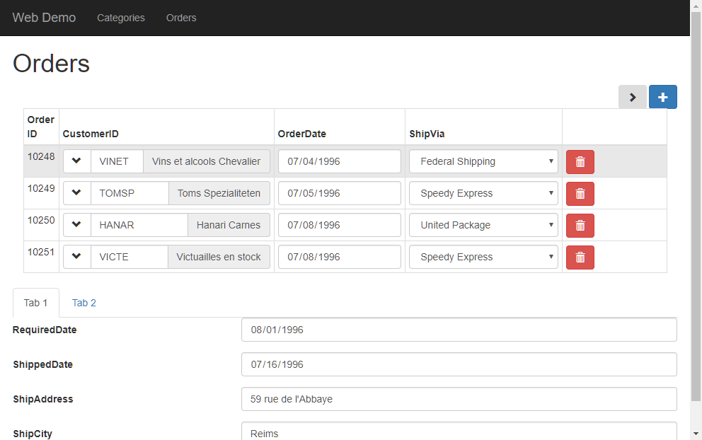
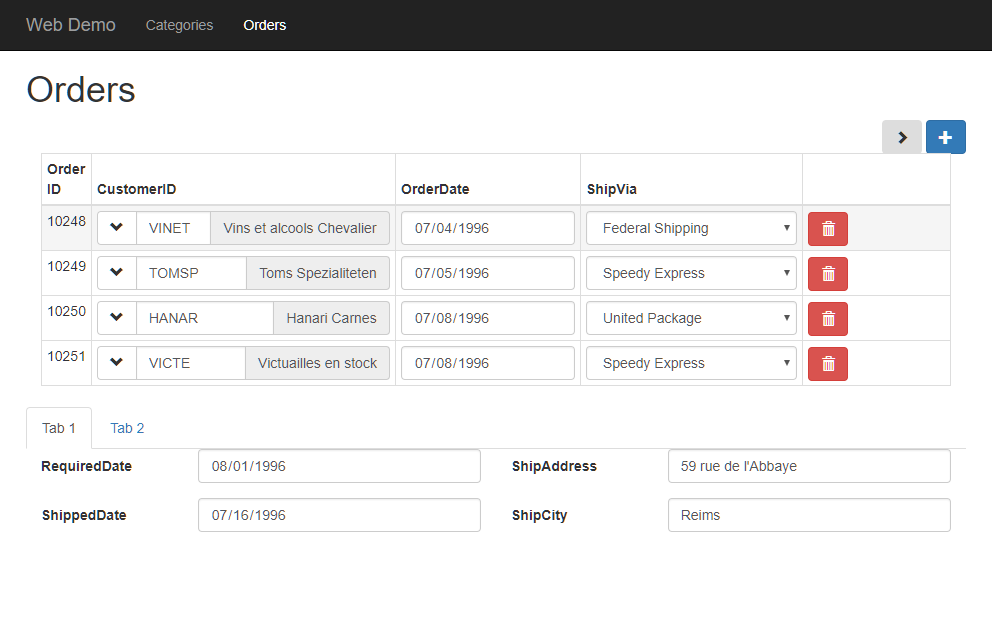

An area is a way to display several controls outside of a grid and group them together in an area.

### Add ship info area into tab 1
* We'll use the add area function to define the area, and move some columns from the order grid to that area

```csdiff
    shippers = new models.shippers();
    orders = new models.orders(
        {
            numOfColumnsInGrid: 4,
            get: { limit:4 },
            allowUpdate: true,
            allowInsert: true,
            allowDelete: true,
            columnSettings: [
                { key: "id", caption: "Order ID", readonly: true },
                {
                    key: "customerID",
                    getValue: o =>
                        this.customers.lookup.get({ id: o.customerID }).companyName,
                    click: o => this.customers.showSelectPopup(c => o.customerID = c.id)
                },
                { key: "orderDate", inputType: "date" },
                {
                    key: "shipVia",
                    dropDown: { source: this.shippers },
                    cssClass: 'col-sm-3'
                },
-               { key: "requiredDate", inputType: "date" },
-               { key: "shippedDate", inputType: "date" },
-               { key: "shipAddress" },
-               { key: "shipCity" },
            ]
        }
    );
+   shipInfoArea = this.orders.addArea({
+       columnSettings: [
+           { key: "requiredDate", inputType: "date" },
+           { key: "shippedDate", inputType: "date" },
+           { key: "shipAddress" },
+           { key: "shipCity" },
+       ]});

```
`src/app/app.component.html`
```csdiff
  <h1>Orders</h1>
  <data-grid [settings]="orders"></data-grid>
  <select-popup [settings]="customers"></select-popup>
  <div>
      <!-- Nav tabs -->
      <ul class="nav nav-tabs" role="tablist">
          <li class="active"><a href="#tab1" data-toggle="tab">Tab 1</a></li>
          <li><a href="#tab2" data-toggle="tab">Tab 2</a></li>
      </ul>
      <!-- Tab panes -->
      <div class="tab-content">
          <div class="tab-pane active" id="tab1">
-             Tab 1 info
+             <data-area [settings]="shipInfoArea"></data-area>
          </div>
          <div  class="tab-pane" id="tab2">
              Tab 2 Info
          </div>
      </div>
  </div>
```



By default all the data column are displayed one after the other. We can split them into more columns:
`src/app/app.component.ts`
```csdiff
shipInfoArea = this.orders.addArea({
+   numberOfColumnAreas:2,
    columnSettings: [
        { key: "requiredDate", inputType: "date" },
        { key: "shippedDate", inputType: "date" },
        { key: "shipAddress" },
        { key: "shipCity" },
    ]});

```



Finally, let's fix the tab name and id
`src/app/app.component.html`
```csdiff
 <h1>Orders</h1>
 <data-grid [settings]="orders"></data-grid>
 <select-popup [settings]="customers"></select-popup>
 <div>
     <!-- Nav tabs -->
     <ul class="nav nav-tabs" role="tablist">
-        <li class="active"><a href="#tab1" data-toggle="tab">Tab 1</a></li>
+        <li class="active"><a href="#shipInfo" data-toggle="tab">Ship Info</a></li>
         <li><a href="#tab2" data-toggle="tab">Tab 2</a></li>
     </ul>
     <!-- Tab panes -->
     <div class="tab-content">
-        <div class="tab-pane active" id="tab1">
+        <div class="tab-pane active" id="shipInfo">
             <data-area [settings]="shipInfoArea"></data-area>
         </div>
         <div  class="tab-pane" id="tab2">
             Tab 2 Info
         </div>
     </div>
 </div>
```