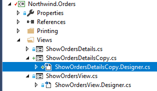

Here are the steps to follow when duplicating a controller.

Duplicating a controller with a view involves the following steps:
1. **Duplicate the class**
2. **Rename the new class and it's constructor**
3. **Duplicate the View class**
4. **Rename the new View class, it's constructor and it's designer class**
5. **Fix the references between the View and the Controller**

<iframe width="560" height="315" src="https://www.youtube.com/embed/MGoDG02VRXE" frameborder="0" allow="autoplay; encrypted-media" allowfullscreen></iframe>

## Duplicating Explained

<iframe width="560" height="315" src="https://www.youtube.com/embed/VxR26WY5Css" frameborder="0" allow="autoplay; encrypted-media" allowfullscreen></iframe>

## Steps Breakdown

### Step 1 - Duplicate the class 

### Step 2 - Rename the new class

Change the class name, in our case from `Details` to `DetailsCopy`

* Don't forgen to rename the constructor.

```csdiff
- internal class Details : Northwind.UIControllerBase
+ internal class DetailsCopy : Northwind.UIControllerBase
  {
-   public Details(ShowOrders parent)
+   public DetailsCopy(ShowOrders parent)
    {
        _parent = parent;
        Title = "Details";
        InitializeDataView();
        InitializeHandlers();
    }    ....
```
### Step 3 - Duplicate the View class
### Step 4 - Rename the new View class 

#### 4.1 -  Rename the View class and it's constructor 
```csdiff
- partial class ShowOrdersDetails : Northwind.Shared.Theme.Controls.CompatibleForm 
+ partial class ShowOrdersDetailsCopy : Northwind.Shared.Theme.Controls.CompatibleForm 
 {
    ShowOrders.Details _controller;
-   internal ShowOrdersDetails(ShowOrders.Details controller)
+   internal ShowOrdersDetailsCopy(ShowOrders.Details controller)
    {
        _controller = controller;
        InitializeComponent();
    }

```
#### 4.2 - Rename the designer class



```csdiff
- partial class ShowOrdersDetails
+ partial class ShowOrdersDetailsCopy
 {
    System.ComponentModel.IContainer components;
    Shared.Theme.Colors.DefaultHelpWindow clrDefaultHelpWindow;
    Northwind.Views.Controls.V9CompatibleDefaultTable grd;
```

### Step 5 - Fix the References between the View and the Controller
#### 5.1 - Fix the reference from the View to the Controller 
```csdiff
partial class ShowOrdersDetailsCopy : Northwind.Shared.Theme.Controls.CompatibleForm 
{
-   ShowOrders.Details _controller;
+   ShowOrders.DetailsNew _controller;
-   internal ShowOrdersDetailsCopy(ShowOrders.Details controller)
+   internal ShowOrdersDetailsCopy(ShowOrders.DetailsNew controller)
    {
        _controller = controller;
        InitializeComponent();
    }
```

#### 5.2 Fix the reference from the Controller to the View 
```csdiff
protected override void OnLoad()
{
    Exit(ExitTiming.BeforeRow, () => u.Level(1) != "RM");
    RowLocking = LockingStrategy.OnUserEdit;
    SwitchToInsertWhenNoRows = true;
    KeepViewVisibleAfterExit = true;
-   View = () => new Views.ShowOrdersDetails(this);
+   View = () => new Views.ShowOrdersDetailsCopy(this);

```