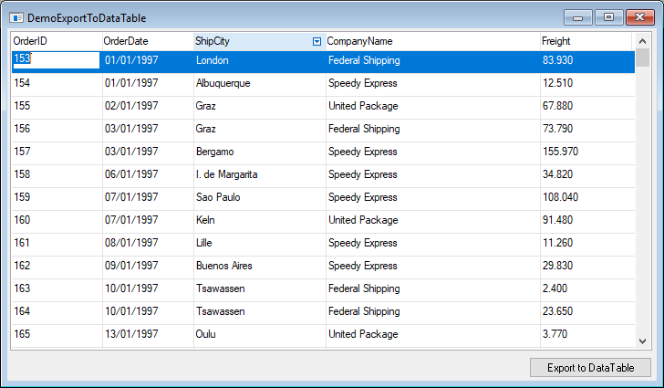
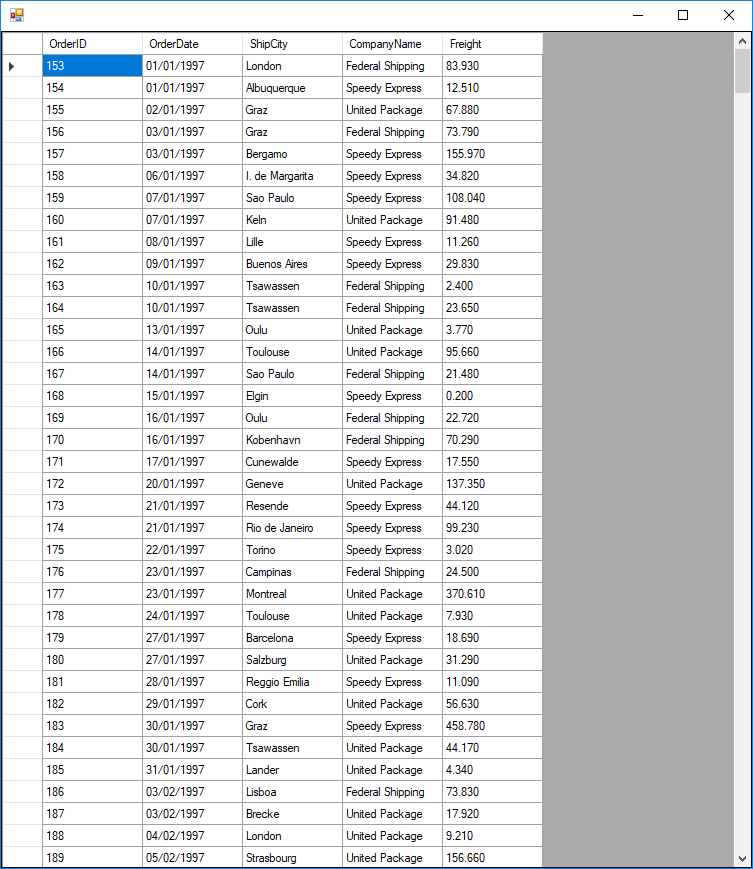

keywords: DataTable, Export to DataTable, DataGridView, DataSource

# Introduction
There are many data controls in .NET that use a DataTable as their data source. 
This article explains how to export the current data view to a DataTable, which can be used to display the data in any .NET control such as the DataGridView or DevExpress controls.

# The ExportToDataTable Method
Assuming we have a UIController with a filtered list of orders:


We want to display the data in a DataGridView control from the System.Windows.Forms namespace:


Here is the code sample to export the current data view to a DataTable:
```csdiff
internal void ExportToDataTable()
{
    var dtb = new DataTableBuilder();
    GridExports.ExportToDataTableBuilder(this._uiController, () =>
    {
        var f = new System.Windows.Forms.Form();
        var gv = new DataGridView
        {
            Dock = DockStyle.Fill,
            DataSource = dtb.Result
        };

        f.Controls.Add(gv);
        f.ShowDialog();

    }, dtb);
}
```

Notice that this._uiController is a member of ENV.AbstractUIController class, which is not accessible by default.
If you want to make it available to any UIController, just add the **protected** access modifier to it:
```csdiff
public abstract class AbstractUIController : ControllerBase
{
+    protected internal UIController _uiController;
```