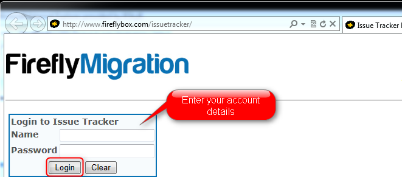
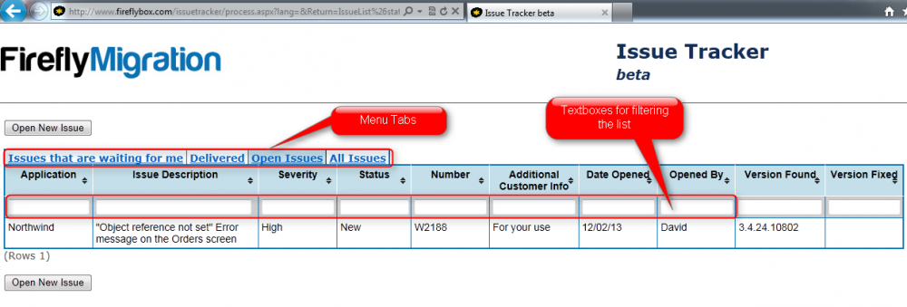
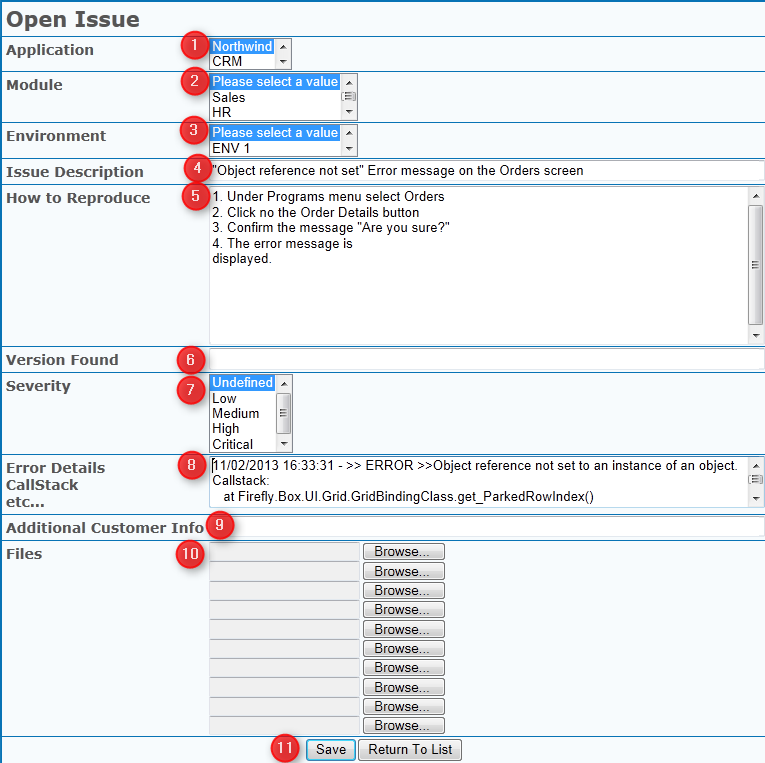
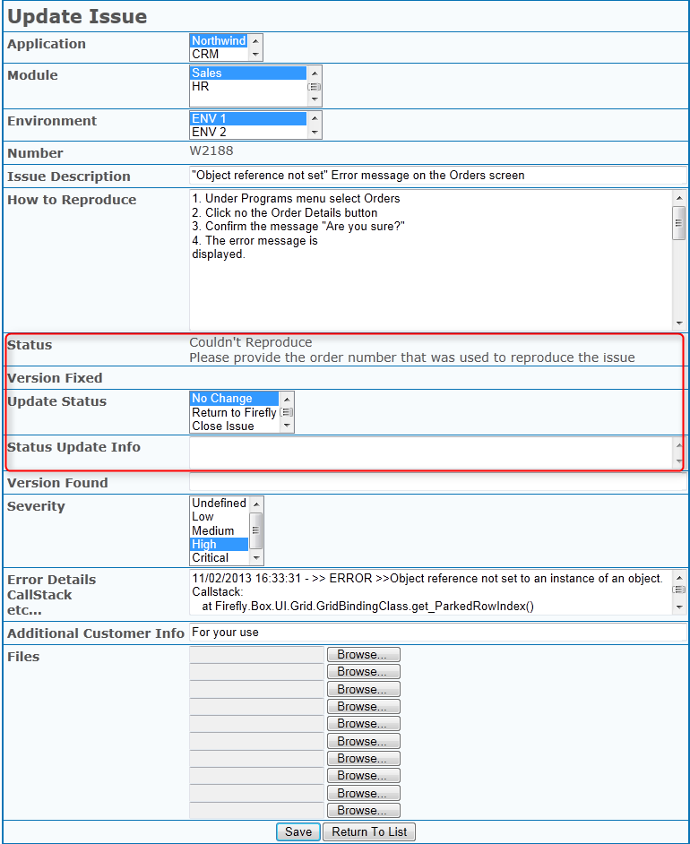

# Using IssueTracker

This article explains how to report issues to Firefly using Firefly's IssueTracker website.  
The IssueTracker is used to report any differnce that was found in the application between the Magic code and the migrated code.  
Behavior, expected results, values, messages, crashes, performance - a difference found in any one of these categories is considered an issue and should be reported.

## Login to IssueTracker

Login to [IssueTracker](http://www.fireflybox.com/issuetracker/) website, using the account details provided by Firefly.

## The Main Screen

After logging in successfully, the main screen will be displayed with the following tabs:

- **Issues that are waiting for me** - Issues that are waiting for your response.
- **Delivered** - Fixed issues that are waiting to be tested and closed by you.
- **Open Issues** - All the open issues that are currently in progress at Firefly.
- **All Issues** - A complete list of all the issues, including open and closed issues.

Each list can be easily filtered or sorted, using the headers and textboxes at the beginning of the table.

## Opening a New Issue

As mentioned above, an issue is considered as a difference between Magic and the migrated code, so please double check 
to ensure that the behavior when using the migrated code is not the same as in Magic.
Furthermore - an issue found by you might have been already fixed (as a report from another customer, so it is best
to migrate again and use the latest version using the same scenario, to make sure the difference still exists.

Clicking the **Open New Issue** button will show the **Open Issue** screen.  
In this screen, you can provide information about the issue, by filling in the following fields:

1. Select the application the issue is related to. (For users who have more than one application).
2. Select the Module where the issue was found. (For an application that has modules information).
3. Select the Environment the issue was reproduced in. (For an application that has more than one environment).
4. Add a description - this should be a one line describing the difference. Please refrain from using a general description.
5. Specify the reproduction steps that will demonstrate the difference:
- Use short and clear instructions (e.g “Use menu XXX”, “Click the YYY button”, "Specify ZZZ in the textbox", "Choose ABC from the Combo", etc.)
- Please include all the steps necessary to replicate the issue. Do not assume we are familiar with the application and, therefore, know how to get to a specific program. Be as detailed as possible - don't spare any detail.
- Provide all the data / values that was entered or selected. 
- Make sure that the issue can be replicated on the test environment that was provided to Firefly.
- The difference should be reproduced at will, as many times as required. In case certain operation are required for that - please indicate them.
- The steps should be numbered - this way, in case of any problem in the reproduction, we can refer to a step number.
6. Enter the number of the version that the issue was found in. This number is shown in the application status bar. (we only need the last 5 digits)
7. Select the severity of the issue, according to the following guidelines:
    - **Critical** - Describe Issues that completely prevent you from continuing testing the entire application or a main part of it, or crucial issues in production.
    - **High** - Describers a crash or data compromising issue that has a workaround.
    - **Medium** - The migrated application behaves different from the original version. This should be the default severity.
    - **Low** - Describes issues you consider as minor / less important.
> We treat the Critical issues with the utmost urgency and, as such, expect you to do the same. So response time is of an essence.

8. The Error Details field is used for providing additional information in case of a crash or for providing logs in case of database related issues. In any other case press CTRL+F12 (or use the Developer Toold context menu from the status bar) in the migrated application to get the callstack of the current location. This info should be copied to the Error Details field.
> This information is highly important - in most cases it saves valuable time during the investigation process.

9. Additional Customer Info - A free text field that you can use for your own information (e.g the issue number in your ALM system)
10. Files - Used for uploading screenshots (Preferred) or videos that emphasizes the issue.
- Add as many screenshots as possible - it helps us find what we need in complex screens / understand what is the exact difference.
- We recommend using [Screenpresso](https://www.screenpresso.com/) for the screenshots - is has useful tools (arrows, area marking, numbering) that will help illuminate the difference
- You can name the files as the correlating step
- Adding a video (also can be done using Screenpresso) does **not** replace the need for the reproduction steps.
- Adding a document with the reproduction steps and screenshots can also be **added** to the reproduction steps.
- In case there are more files to add you can zip them and upload the zip file
- When reporting performance differences, please be sure to add the profiler. You can read about it [here](http://doc.fireflymigration.com/using-firefly-profiler.html)
11. When done click the **Save** button.

## Updating an Issue

If we return the issue back to you, the issue will be on the **Issues that are waiting for me** list, with and appropriate message in the **Status** field.  
You can update the issue with the missing information - clicking the issue line in the list will open the following screen:

In this screen you can add the information in the **Status Update Info** field and then change the **Update Status** of the issue to **Return to Firefly**.

Here are the possible statuses for issues that are in this list:

- **Further Details Required** - The replication procedure is missing steps or other information required for replicating the issue.
- **Couldn't Reproduce** - The Issue could not be reproduced in Firefly's environment and the application behaves as the original application.
- **Reproduced in Magic** - We see the same behavior when using the magic version.
- **To be Fixed by Customer** - The issue is a result of something that needs to be fixed in the original application.
> In such cases we will provide all the information explaining the reason we believe this is the best option. In case there are any doubts / concerns, a meeting will be scheduled to discuss it.
- **Will not be Fixed** - This is an intended difference (usually an improvement behavior or look and feel of the .net version).
> In such **rare** cases we will provide all the information explaining the reason. In case there are any doubts / concerns, a meeting will be scheduled to discuss it.
- **Checked** - The issue was fixed and tested by Firefly and is pending for delivery.
> Do not attempt to test the application yet, as the fix is still not available.

When done click the **Save** button.

_Once you get an email from us regarding an issue, please do not reply to it - updates of issues should be done **only** using the issue IssueTracker system._

## Closing an Issue

Once an issue has been fixed and ready to be tested by you, it will be marked with the **Delivered** status and will be listed under the **Delivered** tab. A fixed issue will have the number of the version in which it was fixed in (indicated in the issue). Once you receive the update email from Firefly, you will need to re-migrate and test the provided scenario.
In case you confirm the issue is resolved, please close it by changing its status to **Close Issue** - otherwise update it to **Return to Firefly** and state the status of the issue.

When done click the **Save** button.