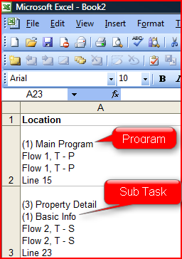
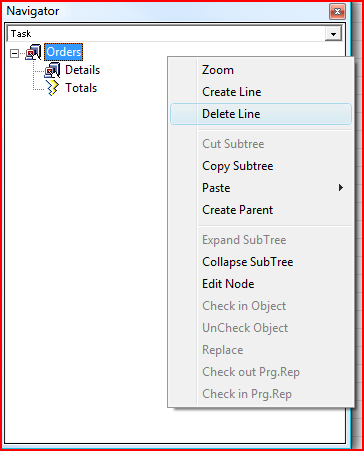

# Code Cleanup

This article explains how to use the Error Report to clean the Magic application from errors and unused code, before migrating it to .NET, while keeping the ability to restore programs that have been removed if needed.  
  
The error report is an XML file which can be displayed in Excel. It includes the following sections:  
1. Errors - Invalid magic code
2. Not Used - Programs, Sub tasks and lines that are suspected as not being used
3. Sql Migration Notices - Notes for Btrieve to SQL migration, which are not part of the cleanup process  

It is recommended to start with removing the unused programs, before dealing with any of the errors. As most of the errors are concentrated in unused programs, this will significantly reduce the number of errors.

The code cleaning work is iterative, as each cycle of removing code might reveal new unused code. In order to produce a new error report after each cycle, you should upload an updated version of your magic code to our automatic migration server and execute a migration process. See Automatic Migration using FTP for more details.

Notice that most of the cleaning work is optional and you can decide if and when you would like to do it, until you commit the final migration. That said, a few of the errors might prevent the .NET code compilation and need to be fixed sooner rather than later. We will inform you of such errors if exists in your code.

Make sure to backup your code before you start to cleanup process and several times during it.

## Removing Unused Code

The Not Used section of the report includes all the programs and subtasks that are suspected as not being used. The first column of the report is the location of the program. Notice that the first line of the location is the program number and name, while the following lines (if exists) are the sub tasks number and name (see screenshot).

If you need to keep some of the programs, although not being used (or being called by their public name etc), it is recommended to mark them (add comment of change their name) to remind you that they have been examined and should not be removed, in the next cycle.

In order to help you identify programs that are being called by their public name of index and therefor should be considered as being used, the report contains all the places where a program is being called dynamically (by an expression).

Regarding sub tasks that are not used, according to the report, notice that only the sub task is considered as not used, and can be removed. Other parts of the program might be used and should not be removed.

In order to keep the ability to restore a program that has been removed, it is important to remove it in a sage method that will sustain the program number as a blank line in the program repository. This is achieved by deleting the program from the intrenal program tree (Navigator window) and not from the programs repository, as follows:

1. Enter to the program by pressing F5 on the program line in the programs repository.
2. Select the program root in the Navigator window and delete it by pressing F3. (see screenshot).  
The program name will remain in the program repository, but it will not be migrated, as empty program are ignored by the migration engine.

While you continue to maintain and develop the magic application, it is recommended that new programs will be added at the end of the program repository, in order to keep the same programs numbers.

## Dealing With Errors

The error report include many types of errors. Some errors can be found be the magic syntax checker(F8) and some cannot. Most errors are tolareted by the migration engine, but some may prevent the code from compiling in .NET, or cause unexpected behavior. Thus, it is recommended to clean the code before the migration to .NET.

Here are some of the common error types you may find in your report and their explanation:

| Error Message                                                       | Explanation                                                                                                                                                                                                                                                                                                  |
|---------------------------------------------------------------------|--------------------------------------------------------------------------------------------------------------------------------------------------------------------------------------------------------------------------------------------------------------------------------------------------------------|
| Can't write form of type gui form to io of type Console             | The form type is not appropriate for the io                                                                                                                                                                                                                                                                  |
| Can't write form of type gui form to io of type requesterIO         | The form type is not appropriate for the io                                                                                                                                                                                                                                                                  |
| Control outside bounds of attached column…                          | The control inside the grid (usually a textbox) is attached to a column, but it is not placed on it exactly, or attached to a different column. This can cause a problem in which after the migration, while parking on the control the characters of the user input or the parking cursor will not be seen. |
| Parameter Mismatch:Called Task {2}parameter index {0}{1}            | The parameter type is different from the type of the value                                                                                                                                                                                                                                                   |
| parameter to program {0}                                            | The same as the last error, some might be redundant                                                                                                                                                                                                                                                          |
| TextPrintingStyles {0} was missing from the TextPrintingStyles file | Unless using a text printer, this error can be disregarded                                                                                                                                                                                                                                                   |

