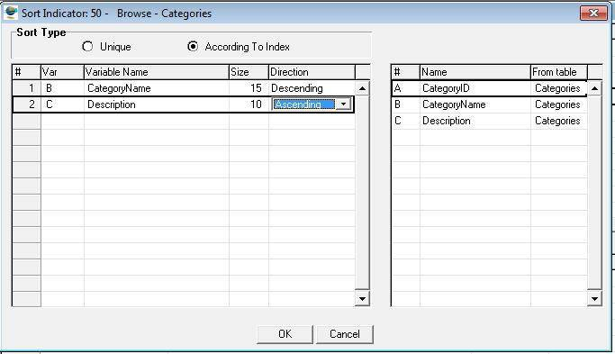

# Introduction
This article is one of a series of articles aimed at providing further orientation with the migrated code for Magic programmers. This time we will look at the 'Sort' screen as it appears in eDeveloper (version 9) and show the equivalent representation of this form of sorting in the migrated code.

---

## The Sort Screen
A screen shot of eDeveloper's Sort screen appears below:



The following explains the equivalent to the Sort Screen in the migrated code.

Name in Migrated Code: **OrderBy**  
Location in Migrated Code: **InitializeDataView method**  

Example:
```csharp
void InitializeDataView()
{
    From = Categories;
    OrderBy.Add(Categories.CategoryName, SortDirection.Descending);
    OrderBy.Add(Categories.Description);
```
Notes:  
For an index specified in the Task Properties Screen, see: [Task Properties Screen - Index](http://www.fireflymigration.com/doc/doku.php/comparison_with_migrated_code/task_properties#index)  
If the 'Unique' radiobutton is selected in Magic, this is reflected in the migrated code in the example below.  
Example:  
```csharp
       void InitializeDataView()
        {
            From = Categories;
            OrderBy.Add(Categories.CategoryName, SortDirection.Descending);
            OrderBy.Add(Categories.Description);
            OrderBy.Unique = true;
```
### See Also:  
* [UIController OrderBy Property](http://www.fireflymigration.com/doc/doku.php/comparison_with_migrated_code/task_control)  
* [Business Process OrderBy Property](http://www.fireflymigration.com/doc/doku.php/start?&#comparing_migrated_code_with_magic)