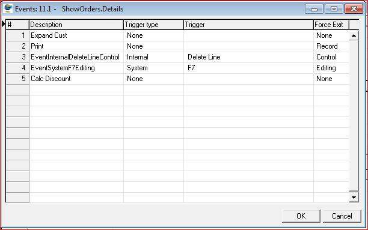
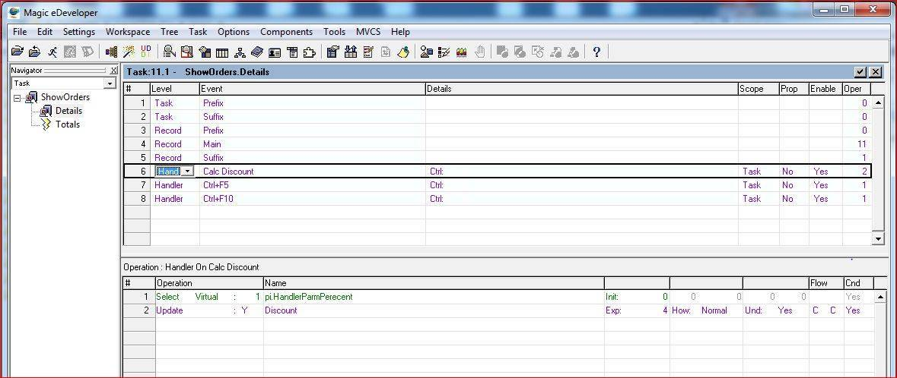

# Introduction

This article is one of a series of articles aimed at providing further orientation with the migrated code for Magic programmers. This time we will look at Handlers as they appear in eDeveloper (version 9) and show the equivalent representation of each setting in the migrated code.

## Defining an Event
The following displays eDeveloper's ctrl-K or Handlers screen:



Name in Migrated Code: **Handlers.Add** and the **Handlers** region of code  
Location in Migrated Code: **Constructor** in the **Event Handlers** section (directly after the constructor  
Example: In the constructor
```csharp
   var PrintHandler = Handlers.Add(Print);
   PrintHandler.Invokes += PrintHandler_Invokes;
```
Example: In the Handler Section:  
```csharp
  void PrintHandler_Invokes(Firefly.Box.Advanced.HandlerInvokeEventArgs e)
  {
     e.Handled = true;
     // send range of this order
     v_Printed.Value = new Print_Order().Run(Orders.OrderID, new UI.ShowOrders_UI(this));
  }
```
The following sections describe the migrated code equivalent for all the event options.

### Description

Name in Migrated Code: In the name of the parameter of the **Handlers.Add** method.  
Location in Migrated Code: **Constructor**  
Example: In the constructor  
```csharp
   var PrintHandler = Handlers.Add(Print);
   PrintHandler.Invokes += PrintHandler_Invokes;
```

### Trigger Type

There are many ways in which a Handler can be triggered and the follwoing sub sections show the equivalent migrated code for each Trigger option.

#### System

Name in Migrated Code: **Keys**  
Location in Migrated Code: **Constructor**   
This defines a handler triggered by a keyboard shortcut.  
Example:
```csharp
var h = Handlers.Add(Keys.Shift | Keys.F3);

```

####Internal

Name in Migrated Code: **Command**  
Location in Migrated Code: **Constructor**   
This defines a handler triggered by an internal event command
Example:
```csharp
var Expand_vMyField_CopyFromHandler = Handlers.Add(Command.Expand, "Copy From");
```
Timer

#### Expression

#### None

### Trigger

### Force Exit

## Defining a Handler

The following displays some Handlers as seen in eDeveloper:

